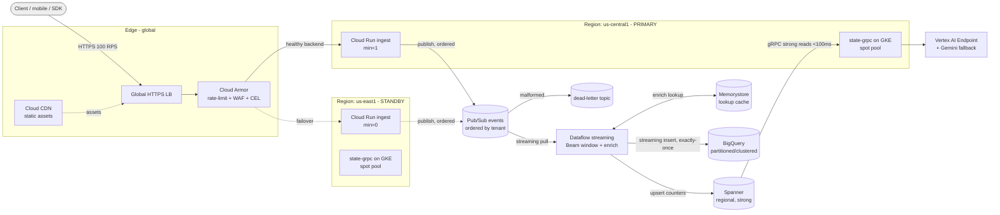

# Lecture 1 — How a Real Architecture Review Runs

> **Reading time:** ~75 minutes. **Hands-on time:** ~45 minutes (you draft your review packet and rehearse the trace-an-event walk).

This is the lecture that turns "I built a thing" into "I can defend a thing." You have spent fourteen weeks accumulating GCP primitives. This week you assemble them and stand in front of people who will try to break your reasoning. That meeting has a name — the **architecture review** — and at a real company it is the gate between a design doc and the engineer-weeks that build it. If you have never sat in one, you imagine it as a hostile interrogation. It is not. A good architecture review is a structured collaboration with a known agenda, a known artifact set, and a known question bank. The reviewers are not trying to make you look bad; they are trying to find the failure mode *before* it finds your users. By the end of this lecture you will know the agenda, the artifacts you bring, the exact questions a staff engineer asks, and how to walk a single event through your system on camera without losing the room.

## 1.1 — What an architecture review is actually for

An architecture review exists to surface, in one hour, the risks that would otherwise surface in production over six months. That is the whole job. Everything in the format serves that goal.

It is **not** a status update. It is not "here is what I built, please clap." It is not a design competition. The reviewers do not care that you used Spanner; they care whether you can say *why* Spanner and not AlloyDB, what it costs, what breaks if a region goes dark, and how you would leave if Google tripled the price. The deliverable of the meeting is a list of risks, each tagged **accept**, **mitigate now**, or **mitigate later**, with an owner. A review that ends without that list failed, no matter how good the slides were.

There are three kinds of review you will encounter in industry, and the capstone simulates all three at once:

1. **The design review** (before you build). The system is a document. The reviewers stress the *plan*. Cheapest place to find a mistake.
2. **The pre-production review** (before you launch). The system runs in staging. The reviewers stress the *implementation* against the plan, and they ask the operational questions: how do you roll back, what pages you, what is the blast radius.
3. **The post-incident review** (after it broke). The system is in production and something failed. This is the blameless postmortem. The reviewers stress the *gap* between what you thought would happen and what did.

Your capstone review is a pre-production review with a postmortem section bolted on (the chaos drill). That is deliberate: it is the most demanding combination, and it is exactly what a hiring panel runs when they put you in front of a whiteboard and say "walk me through a system you built."

## 1.2 — The artifact set you bring to the table

You do not walk into a review with a running terminal and start typing. You bring a packet. The packet is the thing the reviewers read *before* the meeting so the hour is spent on questions, not on catching up. The capstone packet has six artifacts, and they map one-to-one onto the capstone deliverables:

1. **The architecture diagram.** One page. Boxes are services, arrows are data flow, and every arrow is labeled with the protocol and the rough throughput. If you cannot draw it on one page, you do not understand it yet. Mermaid is fine; a PNG is fine; a photo of a whiteboard is fine if it is legible. What is *not* fine is a diagram with twenty boxes and no arrows, or arrows with no labels.

2. **The SLO sheet.** One table. One row per user-facing service. Columns: the SLI (what you measure), the SLO target (the number), the current measured value, the error budget, and the burn-rate alert that protects it. The reviewers read this first because it tells them what "working" means before they ask whether it works.

3. **The cost model.** One table tied to the billing export. The reviewers do not want a guess; they want a query result. "At 100 RPS for a 30-day month this system costs \$X, attributed as follows," with the top five line items.

4. **The chaos-drill postmortem.** What you broke, what happened, what you expected, the gap, and the action items. This is the artifact that separates engineers who have operated systems from engineers who have only built them.

5. **The exit plan.** Two pages. What it costs to leave. Lecture 2 is entirely about this one; it is the artifact that most impresses a staff reviewer because most candidates have never written one.

6. **The runbook pointer.** Not the whole runbook — a pointer to it, plus the answer to one question: "It is 3am and you are paged. What is the first thing you look at?" If you cannot answer that in one sentence, your observability is decorative.

Bring all six. The diagram and the SLO sheet go on screen during the meeting; the rest are pre-reads.

## 1.3 — The agenda: sixty minutes, structured

A review that wanders is a review that does not find the risk. Here is the hour, and it is the hour you will run on Friday:

- **Minutes 0–5 — Context.** What is this system *for*? Who uses it, at what scale, with what consequence if it is down? One sentence of business context, one of scale ("100 RPS sustained, bursts to 1000"), one of the cost ceiling. No architecture yet.
- **Minutes 5–15 — The diagram walk.** You put the one-page diagram on screen and walk it left to right: edge, ingest, stream, process, serve. You do not explain *how* each box works yet; you establish the shape.
- **Minutes 15–30 — Trace one event.** This is the heart of the meeting. You pick one event and follow it: it arrives at the load balancer, passes Cloud Armor, hits Cloud Run, gets validated and published to Pub/Sub with an ordering key, gets pulled by Dataflow, gets windowed and enriched and written to BigQuery, and separately updates current-state in Spanner which the gRPC service reads. You name the failure mode at each hop as you go. This is where the reviewers interrupt with the hard questions, and you let them.
- **Minutes 30–45 — Failure modes and blast radius.** Now you go off the happy path. What happens when each component is down? What is the data-loss window for each failure? What is the blast radius — does a Pub/Sub problem take down ingest, or does ingest keep accepting and buffer?
- **Minutes 45–55 — Cost and exit.** The cost model and the exit plan. The reviewers test whether your numbers are real and whether your lock-in story is honest.
- **Minutes 55–60 — Risk list and sign-off.** The reviewers state the risks they found, tag each accept/mitigate-now/mitigate-later, and assign owners. You write them down. That list is the output.

## 1.4 — The questions a staff engineer will ask

This is the part you came for. Below is the question bank. A staff engineer does not ask all of these; they ask the five that your diagram makes them nervous about. Your job is to have an answer to every one *before* the meeting, so the five they pick are easy.

### Blast radius and single points of failure

- **"What is the single point of failure in this diagram?"** Every system has one; the wrong answer is "there isn't one." For the capstone, the honest answer is usually the regional Spanner instance (single-region by default — multi-region is the stretch goal) or the BigQuery dataset's region. Name it, and say what you do about it.
- **"If Pub/Sub is slow — not down, just slow — what happens to ingest?"** The right answer: Cloud Run keeps accepting requests and the publish call backpressures; you have a publish timeout and you return 503 to the client past a threshold rather than buffering unboundedly in memory. If your answer is "ingest hangs," you have found a real bug in the meeting, which is the entire point of the meeting.
- **"What's the blast radius of a bad deploy to the gRPC serving service?"** The right answer involves your rollout strategy — a GKE rolling update with a PodDisruptionBudget and a readiness probe, so a bad version never takes all replicas at once, plus the burn-rate alert that catches the error spike, plus the one-command rollback.

### Data correctness and durability

- **"Where can you lose data, and how much?"** Walk every hop. At the edge: a request that fails before Cloud Run accepts it is lost, but the client retries (idempotency key). At ingest: a published-but-not-acked message — Pub/Sub gives you at-least-once, so you must dedupe downstream. At Dataflow: exactly-once into BigQuery via the streaming insert dedup, or at-least-once with a dedup key. At Spanner: strongly consistent, no loss. The honest answer names the *window* at each hop, in seconds and in messages.
- **"What is your dead-letter story?"** A Pub/Sub DLQ topic, an alert that fires when it has any depth, and a documented replay procedure. "We don't have one" is a fail.
- **"Your Dataflow pipeline windows on event time. What happens to late data?"** You must know your watermark and allowed-lateness configuration cold. This question separates people who copied a Beam example from people who understand streaming. (Week 09 taught you this; the reviewer is checking whether it stuck.)

### Latency and scale

- **"You claim p99 < 500ms end-to-end. End-to-end from where to where, measured how?"** The trap here is measuring per-hop and summing, which ignores queueing, or measuring from your laptop, which adds your home network. The right answer: measured at the load balancer (request received) to the response sent, read off the Cloud Monitoring distribution metric, under sustained 100 RPS — and you show the dashboard.
- **"What breaks first at 10x?"** You should have run the overload drill (Exercise 2 / the Pub/Sub option) and be able to say "Dataflow lag grows and the DLQ stays empty until ~6x, at which point the subscription backlog triggers the burn-rate alert." A measured answer beats a confident guess every time.
- **"Why min-instances=1 in primary and 0 in standby?"** Cost versus cold-start. You pay for one always-warm instance in primary to kill cold-start on the hot path; standby is cold because failover tolerates a few seconds of warm-up and you do not want to pay for idle capacity in two regions. That is a FinOps decision and you should defend it with the dollar number.

### Security

- **"Show me one credential in the repo."** There should be none. Workload Identity Federation everywhere, Secret Manager for the rest. If `grep -ri "private_key" .` returns anything, you fail this question on the spot.
- **"What can the ingest service's identity do, and is that least privilege?"** The ingest service account should have `pubsub.publisher` on exactly one topic and nothing else. Not `editor`. The reviewer may ask to see the IAM binding.
- **"Your data project is in a VPC SC perimeter. What does that actually stop?"** It stops data exfiltration to a project outside the perimeter even by a credential that has read access. You should be able to name the one deploy step it broke and how you allowed it (an ingress/egress rule), because everyone hits that.

### Operations

- **"It's 3am, you're paged. Walk me through the first five minutes."** The page tells you which SLO is burning. You open the service's dashboard, check the four golden signals, look at the trace exemplars on the latency spike, and decide mitigate-then-investigate. If the answer is "I'd look at the logs," that is too vague — *which* logs, filtered how?
- **"How do you roll back, and how long does it take?"** One command, named, with a time. "Re-apply the previous Terraform state" is acceptable for infra; for the serving service it should be a `kubectl rollout undo` or a Cloud Run traffic split back to the prior revision, in under a minute.
- **"What have you not instrumented?"** The honest answer is always "something." Naming it shows maturity. "I have traces and metrics on every service, but I don't have a synthetic prober hitting the edge from outside GCP, so a DNS-level outage wouldn't page me" is a *great* answer because it is honest and specific.

### Cost

- **"What does one request cost you?"** Divide the monthly cost by the monthly request count. For the capstone that is roughly \$500 / (100 RPS × 86400 × 30) ≈ \$0.0000019 per request. Knowing the number — and that most of the \$500 is *fixed* (the always-warm instance, Spanner, the LB) not per-request — is the insight.
- **"Where's the money going, and what's the first thing you'd cut?"** Off the billing export: usually Spanner and the always-on GKE node pool. The first cut is almost always rightsizing the GKE node pool or moving it fully to spot.

## 1.5 — Trace one event: the demo that wins the room

The single most effective thing you do in the review is trace one real event through the live system, on screen, using your own observability. Not a slide of the trace — the actual trace. Here is the shape of that walk, and the `gcloud`/`bq` commands you run live.

Send one event through ingest with a known idempotency key so you can find it again:

```bash
EVENT_ID="demo-$(date +%s)"
LB_IP=$(gcloud compute addresses describe edge-ip \
  --global --format='value(address)')

curl -sS -X POST "https://${LB_IP}/v1/events" \
  -H "Content-Type: application/json" \
  -H "X-Idempotency-Key: ${EVENT_ID}" \
  -d "{\"tenant\":\"acme\",\"type\":\"page_view\",\"id\":\"${EVENT_ID}\",\"ts\":\"$(date -u +%FT%TZ)\"}"
```

Then show it landed in BigQuery, partitioned by event time and clustered by tenant, scanning almost nothing because the partition filter is on:

```bash
bq query --use_legacy_sql=false --maximum_bytes_billed=100000000 \
'SELECT event_id, tenant, event_type, ingested_at
 FROM `realtime_events.events`
 WHERE DATE(event_time) = CURRENT_DATE()
   AND tenant = "acme"
   AND event_id = "'"${EVENT_ID}"'"'
```

Then show current-state updated in Spanner via the gRPC service (the service exposes a small admin read; you call it with `grpcurl`):

```bash
GRPC_HOST=$(kubectl get svc state-grpc \
  -o jsonpath='{.status.loadBalancer.ingress[0].ip}')

grpcurl -plaintext \
  -d "{\"tenant\":\"acme\"}" \
  "${GRPC_HOST}:443" \
  events.v1.StateService/GetTenantCounters
```

Then — the moment that wins the room — show the distributed trace that ties all of it together. Because every service emits OpenTelemetry, one trace ID spans the load balancer, Cloud Run, the Pub/Sub publish, the Dataflow element, and the Spanner write. You open Cloud Trace filtered to that trace:

```bash
gcloud trace traces list \
  --filter="span:ingest AND +X-Idempotency-Key:${EVENT_ID}" \
  --limit=1 --format='value(traceId)'
```

When you put that waterfall on screen and say "here is one event, 240 milliseconds end to end, and here is exactly where the time went," you have demonstrated more than any slide can: that the system is *observable*, which is the property that lets you operate it. A reviewer who sees a real cross-service trace stops worrying about whether you can debug this thing at 3am.

## 1.5b — The SLO sheet you put on screen

The second artifact that goes on screen (after the diagram) is the SLO sheet, and it sets the entire vocabulary of the review. Reviewers cannot ask "does it work" until you have told them what "work" means. The sheet is one table, one row per user-facing service. For the capstone it looks like this:

| Service | SLI (what we measure) | SLO target | Measured | Error budget | Burn-rate alert |
|---|---|---|---|---|---|
| Ingest (edge → 202) | fraction of requests 2xx within 500ms | 99.9% / 30d | 99.95% | 43.2 min/mo | 14.4x/1h pages; 6x/6h tickets |
| State gRPC | fraction of reads 2xx within 100ms | 99.9% / 30d | 99.97% | 43.2 min/mo | 14.4x/1h pages |
| Pipeline freshness | end-to-end ingest→BigQuery lag p99 | < 60s / 99% | 12s | n/a (latency SLO) | lag > 120s for 10m pages |
| Model serving | scored within 800ms incl. fallback | 99% / 30d | 99.2% | 7.3h/mo | 6x/1h pages |

Three things a reviewer reads off this immediately. First, you have an SLI per service that is *user-meaningful* — "fraction of requests served correctly and quickly," not "CPU < 80%." Second, the measured column is *populated* — you ran the load test (Exercise 1) and these are real numbers, not aspirations. Third, the burn-rate column proves the alert exists and is tuned to page on fast burn, not on every blip (Week 13). A reviewer who sees a populated SLO sheet relaxes; a reviewer who sees "TBD" in the measured column knows you have not actually operated this thing.

The freshness SLO row is the one candidates forget. Ingest p99 < 500ms only describes the *synchronous* path (edge → 202). The *asynchronous* path (Pub/Sub → Dataflow → BigQuery) has its own SLO — pipeline freshness — and it is the one that bends under the overload drill. Putting it on the sheet shows you understand that "the system is fast" is two separate claims about two separate paths.

## 1.5c — The cost model row a reviewer trusts

The third on-screen artifact is the cost model, and the reviewer's only question is "is this a measurement or a guess." The answer must be "a measurement," which means it comes off the billing export, not the pricing calculator. The table:

| Line item | Monthly (at 100 RPS) | % of total | Fixed or per-request |
|---|---|---|---|
| Spanner (regional, 1 node) | \$260 | 52% | fixed |
| GKE serving pool (spot) | \$70 | 14% | fixed |
| Cloud Run ingest (min=1 primary) | \$45 | 9% | mostly fixed |
| Global LB + Cloud Armor | \$40 | 8% | fixed |
| Dataflow (1–3 workers, spot) | \$35 | 7% | scales with load |
| BigQuery (storage + streaming inserts) | \$25 | 5% | per-request-ish |
| Pub/Sub + Memorystore + misc | \$25 | 5% | mixed |
| **Total** | **~\$500** | 100% | mostly fixed |

The insight you state out loud, and that reads as senior: **most of the cost is fixed, not per-request.** Doubling traffic to 200 RPS barely moves this bill, because Spanner, the LB, and the always-warm instance are paid whether or not a request arrives. That means the cost-per-request is *dominated by the floor*, and the optimization that matters is not "make each request cheaper" but "is the floor justified." The first cut a reviewer will probe is the \$260 Spanner node — and your answer is the exit-plan answer: you depend on it for strong cross-region consistency, and here is the regional-vs-multiregion tradeoff. (Lecture 2 prices exactly this.)

## 1.6 — Reading the p99 honestly

When a reviewer asks "p99 of what, measured how," they are testing whether you understand coordinated omission and where the measurement happens. The wrong place to measure end-to-end latency is your load generator if it stops sending while waiting for slow responses — that hides the worst latencies behind the very back-pressure they cause. The right place is the load balancer's own latency distribution metric, which records every request's total time server-side.

Here is the MQL you put on the dashboard and read live (the LB exports `loadbalancing.googleapis.com/https/total_latencies` as a distribution):

```text
fetch https_lb_rule
| metric 'loadbalancing.googleapis.com/https/total_latencies'
| filter (resource.url_map_name == 'edge-url-map')
| align delta(1m)
| every 1m
| group_by [], [value_p99: percentile(value.total_latencies, 99)]
```

The number that comes off that query, sampled across the 30-minute 100-RPS window, is the number you defend. If it is 380ms, you say 380ms. If it spiked to 620ms during a deploy and you have the deploy annotated on the chart, you *show* that and explain it — a reviewer trusts a number with a visible spike-and-recovery far more than a suspiciously flat line. Honesty about the distribution is the entire credibility play.

## 1.7 — The failure modes of the *reviewer*

Reviews fail in both directions. You should know the reviewer anti-patterns so you can steer around them, because a derailed review wastes the one hour you get.

- **The bikeshedder.** Spends fifteen minutes on the naming of a Pub/Sub topic and never gets to the data-loss window. Steer back: "Happy to take the naming offline — can we make sure we cover the failover window while we have everyone here?"
- **The "I would have used X" reviewer.** Wants to redesign your system as theirs. Acknowledge and redirect: "Kafka would also work; here's the specific reason Pub/Sub won for *this* workload [cost / ops burden / it's already in the org]. Is there a risk in the choice I made, specifically?"
- **The silent reviewer.** Says nothing, then sandbags you afterward. Draw them out: "I haven't heard from you — is there a failure mode you're worried about?"
- **The deep-diver.** Goes three levels into one component and never surfaces. Time-box it: "Let's spend two more minutes here and then I want to make sure we cover the cost model."

Your job as the presenter is to *run* the meeting even though you are the one being reviewed. The candidate who manages the room — keeps it on the agenda, surfaces their own known risks before the reviewers find them, and writes down the action items — reads as senior regardless of the architecture.

## 1.8 — Surfacing your own risks first

The single highest-leverage move in a review is to name your own biggest risk before anyone asks. It does two things: it demonstrates that you actually understand the system's weaknesses (juniors think their design is flawless; seniors know exactly where the bodies are), and it sets the agenda so the reviewers spend their energy on the risk you already know about instead of hunting for a "gotcha."

For the capstone, the honest self-named risks are usually:

1. **Single-region Spanner.** "The biggest risk in this diagram is that Spanner is regional. A region loss takes out current-state reads. I've documented the multi-region upgrade path and its cost; I chose regional for the capstone budget. Here's the dollar delta to fix it."
2. **The standby region is cold.** "Failover takes ~90 seconds because standby Cloud Run is at min-instances=0. I traded failover speed for steady-state cost. If this were a payments system I'd flip that."
3. **BigQuery is the analytical store, not the serving store.** "If someone tries to serve user-facing reads from BigQuery they'll hit per-query latency and cost they don't expect. Serving reads go to Spanner; BigQuery is for analytics. I enforce that with IAM, not just convention."

A reviewer who hears you name these walks away thinking *this person has operated systems*. That is the impression that gets you the senior offer.

## 1.9 — What to do with the risk list

The review ends with a risk list. The mistake is to nod, feel relieved it is over, and never look at the list again. The discipline is to turn each item into a tracked action with an owner and a due date, even if the owner is you and the due date is "before I put this on my portfolio."

For the capstone, your risk list becomes the "Known limitations and next steps" section of your README. That section is a *feature*, not an admission of failure. A portfolio repo that says "here are the three things I'd fix before this took real traffic, in priority order, with the cost of each" is dramatically more credible than one that pretends the system is perfect. Hiring managers read the limitations section first, because it is where they learn whether you can think.

## 1.10 — Rehearsing the trace-an-event walk

Do not improvise the live demo. The trace-an-event walk (§1.5) is the highest-stakes ninety seconds of the review, and it involves a live system that can misbehave. Rehearse it three times before Friday:

1. **Dry run with the system warm.** Send the event, find it in BigQuery, find it in Spanner, pull the trace. Time it. It should be under three minutes of clicking and typing.
2. **Dry run with a pre-staged fallback.** Networks fail during demos. Have a screen recording of a *successful* trace walk ready to play if the live system hiccups. Saying "the live system is having a moment, here's a recording of the same walk from an hour ago" is completely acceptable and far better than freezing.
3. **Dry run narrating out loud.** The words matter as much as the clicks. Practice saying "this event arrived at 14:32:01, cleared Cloud Armor, was published to the `events` topic with ordering key `acme`, and you can see the publish span here taking 8 milliseconds." Narration that names the mechanism reads as mastery.

The recorded 5-minute video (a capstone deliverable) is essentially this walk, edited. If you rehearse the live walk well, the video is a thirty-minute recording session, not a thirty-take ordeal.

## 1.10b — The one-page diagram, in Mermaid

The diagram is the first thing on screen and the thing reviewers stare at for the whole hour, so it has to be both complete and legible. Mermaid is the right tool: it renders in GitHub, it diffs cleanly in version control, and it forces you to express the system as nodes and labeled edges rather than as decorative clip art. Here is the capstone diagram you would put in `diagram.md`, annotated with the protocol and rough throughput on every edge:



The discipline this enforces is worth dwelling on. Every edge has a label — a reviewer can read the protocol and the rough rate off the arrow without you narrating. The two regions are visually separate, and the failover relationship is a dashed edge, so the eye immediately sees what is hot and what is standby. The async path (Pub/Sub → Dataflow → BigQuery/Spanner) is visually distinct from the sync path (client → LB → ingest → 202), which is exactly the distinction §1.5b said you must keep straight. If your diagram cannot be read this way in ten seconds, simplify it until it can.

A test you can apply before the meeting: hand the rendered diagram to someone who has never seen your system and ask them to trace one event out loud. If they can, the diagram is good. If they stall — "wait, does this arrow mean a call or a data flow?" — you have an unlabeled edge or an ambiguous node, and you fix it before the review, not during it.

## 1.10c — The runbook pointer and the "3am" answer

The sixth artifact (§1.2) is the runbook pointer, and the question it must answer is the most operational question in the review: "it's 3am, you're paged, what's the first thing you look at?" The answer is not a paragraph; it is a single command or a single dashboard, and then a decision tree. Here is the shape of the "first five minutes" section of the capstone runbook:

```text
PAGE: ingest-slo-fast-burn
  1. Open the ingest SLO dashboard:
       gcloud monitoring dashboards list --filter="displayName:Ingest SLO"
     Look at the four golden signals: latency p99, error rate, RPS, saturation.
  2. Is this a region event? Check https://status.cloud.google.com
     - If yes: failover is automatic. Confirm standby is serving (trace one request),
       then WAIT. There is nothing to mitigate; the page is expected. Annotate the incident.
     - If no: continue.
  3. Is error rate up or latency up?
     - Errors up: check the latest deploy. Recent revision?
         kubectl rollout history deployment/state-grpc
       If a deploy correlates, roll back:
         kubectl rollout undo deployment/state-grpc
       For Cloud Run, shift traffic to the prior revision:
         gcloud run services update-traffic ingest --to-revisions=PRIOR=100 --region=us-central1
     - Latency up, no errors: check saturation. Cloud Run at max-instances?
         Raise max-instances, re-evaluate. Dataflow lagging? Check backlog metric.
  4. Mitigate first, investigate after. Capture the trace exemplars on the latency
     spike for the postmortem before they age out of Cloud Trace (30-day retention).
```

The point of putting this in the review is not that the reviewers read the whole runbook — they read the *first line* and judge whether your observability lets you answer "what's wrong" in one look. If your first step is "grep the logs," that is too vague and the reviewers will say so. If your first step is "open the SLO dashboard, which tells me which signal is degraded," that is an operable system. The runbook is downstream of the observability work you did in Week 13; this is where it proves its worth.

## 1.11 — A worked transcript: the failover question

Reading the question bank is one thing; hearing how a good answer *sounds* is another. Here is a reconstructed exchange from a capstone-style review, lightly edited. The candidate is presenting; "R" is the staff reviewer.

> **R:** You've got primary in us-central1 and standby in us-east1. Walk me through what happens when us-central1 goes dark — not a single instance, the whole region.
>
> **Candidate:** Two things fail and they fail differently. The ingest path fails over automatically: the global LB health-checks both regional backends, so when the primary backend stops passing health checks the LB routes new requests to us-east1. That's a health-check-interval delay — I have it set to 10 seconds with a 3-failure threshold, so about 30 seconds before traffic shifts. The catch is that standby ingest is at min-instances=0, so the first requests after the shift eat a cold start, maybe another 30 to 60 seconds of elevated latency. Net failover for ingest is under two minutes, well inside the 5-minute SLO. I measured it — it's in the postmortem, recovery was 94 seconds.
>
> **R:** And the data? You said two things fail differently.
>
> **Candidate:** Right. Spanner is regional in primary. If us-central1 is gone, current-state reads via the gRPC service are down until the region recovers, because I chose single-region Spanner for the budget. That's my biggest risk and it's the first thing I'd fix with money — multi-region Spanner is roughly an extra \$700 a month at the smallest config, and it would make reads survive a region loss. For the capstone I documented the upgrade path instead of paying for it.
>
> **R:** So you lose reads. Do you lose data?
>
> **Candidate:** No, and that's the part I want to show. Events already published to Pub/Sub before the region died are durable — Pub/Sub is regional but the topic survives a single-zone loss, and for a full-region scenario I have the dataset's snapshot copy. When Dataflow workers come back, they drain the backlog, and the dead-letter subscription depth is unchanged. In the drill, the backlog drained in about four minutes and the DLQ stayed at zero. So: reads are interrupted, writes are buffered, zero data loss.
>
> **R:** What would page you during this?
>
> **Candidate:** The ingest SLO burn-rate alert fires within the first minute because the cold-start window pushes p99 over budget briefly, and the pipeline-freshness alert fires if the backlog takes longer than two minutes to start draining. Both are real pages, both are expected during a regional failover, and the runbook's first line is "confirm it's a region event in the Cloud status dashboard before you start mitigating, because there's nothing to mitigate — the failover is automatic."

Notice what made that answer strong. The candidate distinguished the two failure domains (synchronous ingest vs. the data tier), gave *measured* numbers from a drill rather than estimates, named their own biggest risk with its dollar cost before being pushed, and closed the loop on observability (what pages, and what the runbook says to do). That is the shape of every good review answer: specific, measured, honest about the weakness, and connected to the operational reality.

## 1.12 — Common ways candidates lose the review

To round out the playbook, the recurring own-goals. Each one is avoidable with preparation:

- **Reading the diagram instead of walking it.** "This is the load balancer, this is Cloud Run, this is Pub/Sub…" narrating boxes without data flow or failure modes. Walk the *event*, not the *components*.
- **Defending a choice on taste.** "I used Spanner because it's the best database." A reviewer hears "I don't know the tradeoff." Defend on the requirement: "I used Spanner because I need strong reads across regions and the alternatives don't give me that without operating a cluster."
- **Claiming numbers you didn't measure.** "It does about 500 RPS, p99 around 200ms." The instant follow-up is "show me," and if you can't, every other number you stated is now suspect. Measure first (Exercise 1), then claim.
- **Hiding the weakness.** Pretending single-region Spanner is fine, hoping nobody notices. They notice, and now it looks like you either didn't know or tried to slip it past them. Name it first.
- **No teardown story.** "It's deployed." "Can you redeploy it from scratch?" Silence. A system you can't `terraform apply` and `destroy` on demand is a pet, not a system, and the review will surface that fast.
- **Losing the room to a rabbit hole.** Letting a deep-diver pull you into the CIDR math of the standby subnet for fifteen minutes while the cost model and exit plan go uncovered. Time-box and steer (§1.7).

Prepare against all six and the review becomes what it is supposed to be: a productive hour that makes your system better and makes you look like someone who has done this before.

## 1.13 — The mock interview: the review's twin

The capstone week also runs a mock interview, and it is worth understanding why it sits next to the architecture review, because they are two views of the same skill. The architecture review defends a system *you built*. The interview asks you to design a system *on the spot* and then deep-dive a GCP component. Both reward the same muscles: tracing data flow, naming failure modes, defending tradeoffs with numbers, and being honest about what you do not know.

The mock interview has two rounds, mirroring the real L4/L5 phone-screen shape:

- **Round one — system design (45 min).** A prompt like "design a streaming analytics platform on GCP" or "design a multi-region key-value store with strong consistency." You drive: clarify requirements and scale first ("how many events per second, what's the consistency requirement, what's the latency budget?"), sketch the boxes, walk the data flow, then go deep where the interviewer pushes. The capstone *is* the streaming-analytics answer — you have built and operated it — so this round is where your fourteen weeks pay off most directly.
- **Round two — GCP deep-dive (30 min).** A focused drill: "here's a GKE pod that can't reach BigQuery, debug it" or "this BigQuery query costs \$2000, find out why." These map to the four deep-dive drills in `interview-prep/` (IAM, VPC, GKE, BigQuery query-plan). The interviewer is checking depth, not breadth — they want to see you reason from symptom to cause, not recite documentation.

The single most common mock-interview mistake is the same as the review mistake: **jumping to a solution before establishing the requirements.** A candidate who hears "design a streaming platform" and immediately starts drawing Kafka topics has failed before they began, because they have not asked what scale, what consistency, what budget, or what the consequence of data loss is. The strong candidate spends the first five minutes on requirements, states the assumptions out loud, and *then* designs — exactly the "context first" opening of the review agenda (§1.3). Practice the requirements-clarification opening until it is automatic; it is the highest-signal ninety seconds of any design interview.

The second most common mistake is bluffing on the deep-dive. When the interviewer asks "what does Private Google Access actually change at the routing level" and you do not know, "I'm not certain of the exact mechanism, but my mental model is that it lets instances without external IPs reach `*.googleapis.com` over Google's backbone — let me reason about why that would matter here" is a *strong* answer. "It uses a special protocol" when you are guessing is a *weak* one, and interviewers can always tell. Honesty about the edge of your knowledge, paired with the reasoning you *can* do, is what distinguishes the senior candidate. It is the same honesty the review rewards when you name your own biggest risk.

Write the retrospective afterward (Homework Problem 6): the two questions you answered well, the one you fumbled, and what you would say differently. The fumble is the valuable part. An engineer who can name their own weak answer and articulate the better one has the exact metacognition that makes the *next* interview go better — and it is the same skill as turning a review's risk list into a "known limitations" section. The review and the interview are the same competence wearing two hats.

## Summary

An architecture review is a one-hour search for the risks that would otherwise take six months to find in production. You bring six artifacts: the diagram, the SLO sheet, the cost model, the chaos postmortem, the exit plan, and the runbook pointer. You run a structured hour: context, diagram walk, trace one event, failure modes, cost and exit, risk list. The staff-engineer question bank clusters around blast radius, data correctness, latency, security, operations, and cost — and the move that reads most senior is to name your own biggest risk before anyone asks. The live trace-an-event walk, using your own OpenTelemetry, is the demonstration that wins the room, because it proves the system is observable enough to operate. Rehearse it. The risk list the review produces is not an indictment; it is the "known limitations" section that makes your portfolio credible.

Lecture 2 takes the one artifact reviewers find most impressive and most candidates have never written: the exit plan.
