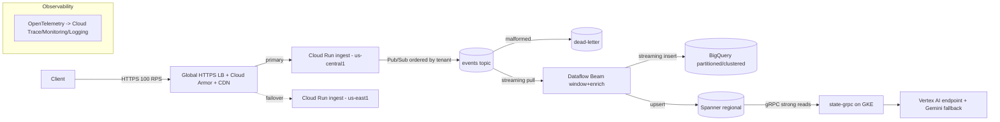

# Week 15 Homework

This is the last homework of C18, and it is not "more problems" — it is the set of capstone deliverables that are not already covered by the mini-project build itself. Each one is a concrete artifact a hiring manager or a staff reviewer will read. The full set should take about **5 hours** spread across the week. Work in your capstone repo so each deliverable is a commit you can point to.

Each problem includes a **statement**, **deliverable**, **acceptance criteria**, a **hint**, and an **estimated time**. The rubric at the bottom is how the week is graded.

---

## Problem 1 — The one-page architecture diagram

**Statement.** Draw the capstone architecture as a single-page Mermaid diagram in `diagram.md`. Boxes are services, arrows are data flow, every arrow labeled with the protocol and rough throughput. If it doesn't fit on one page, your mental model is too detailed — abstract until it does.

**Deliverable.** `diagram.md` with a Mermaid `flowchart` that renders in GitHub.

**Acceptance criteria.**

- [ ] Shows all five tiers: edge, ingest, stream, process, serve, plus observability and security as cross-cutting.
- [ ] Every arrow is labeled (e.g. `HTTPS 100 RPS`, `Pub/Sub ordered`, `gRPC`, `Spanner strong`).
- [ ] Both regions are visible, with the failover relationship indicated.
- [ ] Renders without syntax errors in the GitHub Mermaid preview.

**Hint.** Start from the SYLLABUS capstone description. A skeleton:



**Estimated time.** 45 minutes.

---

## Problem 2 — The 2-page exit plan

**Statement.** Write `EXIT-PLAN.md` following the Lecture 2 template: dependency inventory with portability tiers, a target architecture (pick AWS *or* self-hosted), what you keep, the engineer-week estimate by component, the steady-state cost delta, and the risks / one-way doors.

**Deliverable.** `EXIT-PLAN.md`, two pages when rendered.

**Acceptance criteria.**

- [ ] Every managed GCP service the capstone uses appears in the inventory table with a tier (green/yellow/orange/red) and a named replacement.
- [ ] A summed engineer-week estimate (your number, defensible — the lecture's ~17 is a reference, not the answer).
- [ ] The steady-state cost delta is honest in *both* directions (compute vs operational headcount).
- [ ] A conclusion that states whether leaving is worth it *at this scale* and the threshold at which it changes.

**Hint.** The one true red dependency is Spanner's external consistency. Be specific that CockroachDB gives serializable, not the same TrueTime guarantee — and that most apps need serializable anyway. (Lecture 2, §2.4, §2.6.)

**Estimated time.** 75 minutes.

---

## Problem 3 — The cost report from the billing export

**Statement.** Write `cost-report.md`: derive the capstone's monthly cost at 100 RPS from the billing-export-to-BigQuery table (not a guess), show it is under \$500/month, and name three optimization moves with an annualized estimate of each.

**Deliverable.** `cost-report.md` with the BigQuery query, the result, and three moves.

**Acceptance criteria.**

- [ ] Includes the actual SQL run against the billing export, grouped by `service.description`.
- [ ] Shows the top five line items by cost.
- [ ] States the projected monthly total under \$500 and the cost-per-request.
- [ ] Three optimization moves, each with an estimated annual saving.

**Hint.** The grouping query against the standard export schema:

```sql
SELECT
  service.description AS service,
  ROUND(SUM(cost), 2) AS cost_usd,
  ROUND(SUM(IFNULL((SELECT SUM(c.amount) FROM UNNEST(credits) c), 0)), 2) AS credits_usd
FROM `PROJECT.billing_export.gcp_billing_export_v1_XXXXXX`
WHERE _PARTITIONTIME >= TIMESTAMP_SUB(CURRENT_TIMESTAMP(), INTERVAL 7 DAY)
GROUP BY service
ORDER BY cost_usd DESC
LIMIT 10;
```

The usual three moves: move the GKE serving pool fully to spot, rightsize the Dataflow worker bounds, and apply a committed-use discount to the always-on compute. (Week 14.)

**Estimated time.** 60 minutes.

---

## Problem 4 — The chaos-drill postmortem

**Statement.** Run one chaos drill with `exercise-02-chaos-drill.py`, then fill in the generated `POSTMORTEM.md` skeleton with the prose sections: what you expected, what actually happened, the gap, did data move correctly, and action items tagged accept/mitigate-now/mitigate-later.

**Deliverable.** A complete `POSTMORTEM.md` (blameless, modeled on the Google SRE postmortem culture chapter in `resources.md`).

**Acceptance criteria.**

- [ ] The measured timeline (fault, impact, recovery, recovery_seconds) is filled in from the script output.
- [ ] For region failover: recovery < 5 min and a data-loss verdict (DLQ unchanged).
- [ ] Prose sections completed — no `<!-- ... -->` placeholders left.
- [ ] At least two action items, each tagged and owned.
- [ ] The tone is blameless (focus on system gaps, not "I forgot").

**Hint.** The strongest postmortems name a surprise. If the failover took 90s instead of the 30s you expected because standby was cold-starting, *that* is the finding, and "warm standby to min-instances=1 if RTO matters more than cost" is the action item.

**Estimated time.** 60 minutes.

---

## Problem 5 — Clear the PCA / Cloud DevOps readiness gate

**Statement.** Sit the practice exam (`exercise-03-pca-readiness-gate.py`) and clear the >=70% gate. Then identify your two weakest blueprint domains and write a one-paragraph study plan for each.

**Deliverable.** A `readiness.md` with your score, the per-domain breakdown, and the study plan; plus the practice-exam printout.

**Acceptance criteria.**

- [ ] The script printed `READINESS GATE: PASS` (>=70%).
- [ ] The per-domain breakdown is recorded.
- [ ] A concrete study plan for the two weakest domains, each pointing at the relevant C18 week(s) and the official blueprint section.
- [ ] If you passed first try, re-run `--domain <weakest>` until that domain is 100% and note it.

**Hint.** Run `python3 exercise-03-pca-readiness-gate.py --review` after to read every rationale; the domains map directly onto the course weeks (networking → W03, data → W09–11, devops → W04/W13/W14, etc.).

**Estimated time.** 45 minutes (plus retakes).

---

## Problem 6 — The 5-minute video script + mock-interview notes

**Statement.** Two short writing tasks. (a) Write the *script* for your 5-minute video — the trace-an-event narration from Lecture 1 §1.5, timed. (b) After your mock interview, write a half-page retrospective: the two questions you answered well, the one you fumbled, and what you'd say differently.

**Deliverable.** `video-script.md` and `mock-interview-retro.md`.

**Acceptance criteria.**

- [ ] The video script is timed and stays under 5 minutes when read aloud at a normal pace.
- [ ] It narrates one real event through the system, naming the mechanism at each hop.
- [ ] The mock-interview retro names two strengths, one fumble, and a concrete fix for the fumble.
- [ ] Both are honest — a retro that says "I nailed everything" fails this problem.

**Hint.** Rehearse the script out loud once before timing it; people read ~150 words/minute, so 5 minutes is ~750 words. Cut ruthlessly. (Lecture 1, §1.10.)

**Estimated time.** 45 minutes.

---

## Rubric

Graded out of 100. This homework is the deliverable scaffolding for the capstone, so the weights mirror the capstone's emphasis.

| Problem | Artifact | Points | What earns full marks |
|---|---|---:|---|
| 1 | `diagram.md` | 15 | One page, all tiers, every arrow labeled, renders in GitHub. |
| 2 | `EXIT-PLAN.md` | 25 | Every dependency tiered + priced; honest both-directions cost delta; scale-aware conclusion. |
| 3 | `cost-report.md` | 15 | Real billing-export SQL + result under \$500/mo + three priced moves. |
| 4 | `POSTMORTEM.md` | 20 | Measured timeline + blameless prose + data-loss verdict + owned action items. |
| 5 | `readiness.md` | 15 | Gate cleared (>=70%) + per-domain breakdown + study plan for the two weakest. |
| 6 | video script + retro | 10 | Timed <5-min script narrating one event; honest mock-interview retro. |

**Passing the week** requires >=70 on this rubric *and* a capstone that stands up and tears down on demand (the mini-project / Challenge 1 gate). The two are scored together; a perfect homework with a system that won't `terraform destroy` does not pass.

**Deductions.** Any long-lived credential found in the repo: −20 and a required fix. Any `terraform destroy` that leaks a resource: −20 and a required fix. A cost report or exit plan that is guessed rather than derived: −10 each. These are the production-shop non-negotiables; the deductions are deliberately harsh because in a real shop they are incidents.
